# THMMY CSS Override

A clean, modern visual refresh for thmmy.gr. It strips out the clutter, adds collapsible sidebars/headers, and introduces proper Dark and Light modes. Pure CSS, applied locally via your browser. 

### Comparisons

| Original | Light Mode | Dark Mode |
| :---: | :---: | :---: |
| **Forum Index** 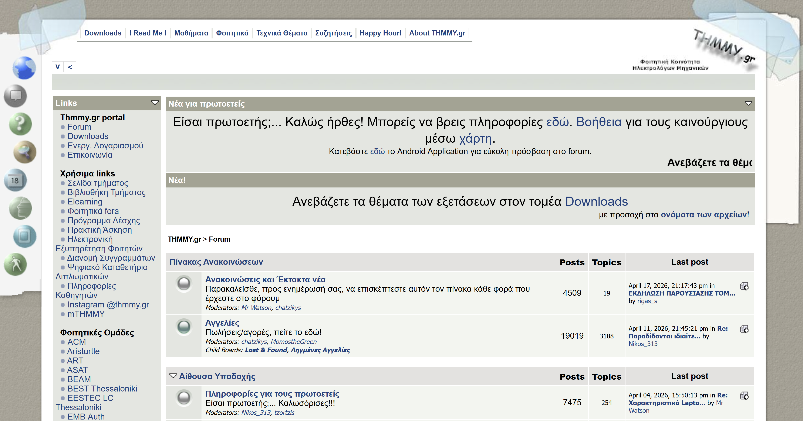 |  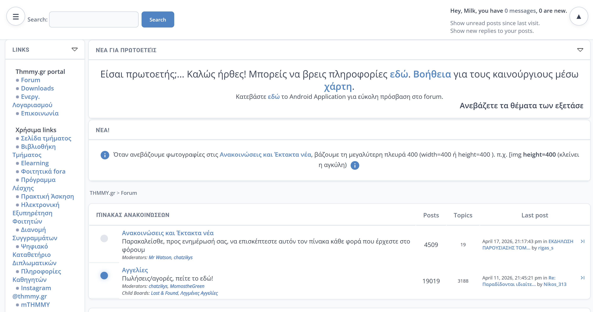 |  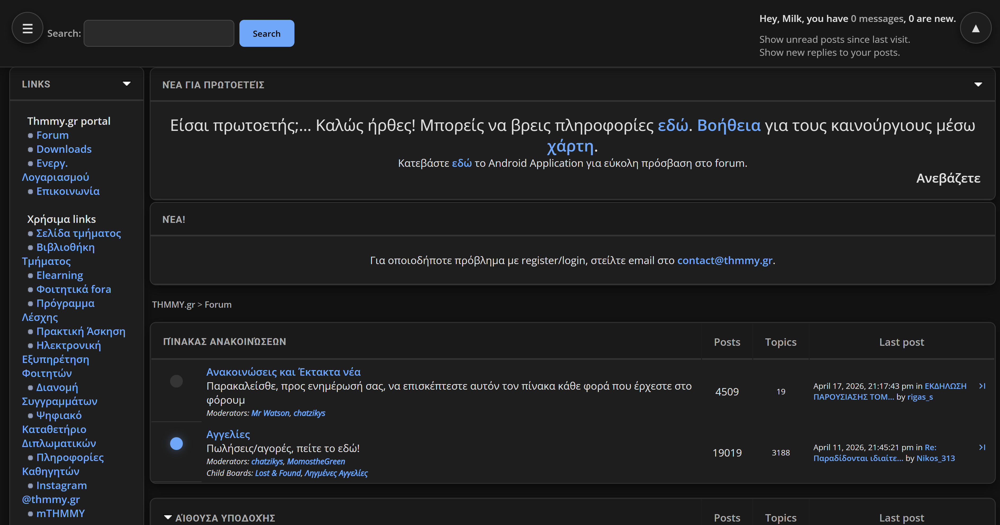 |
| **Topic View** 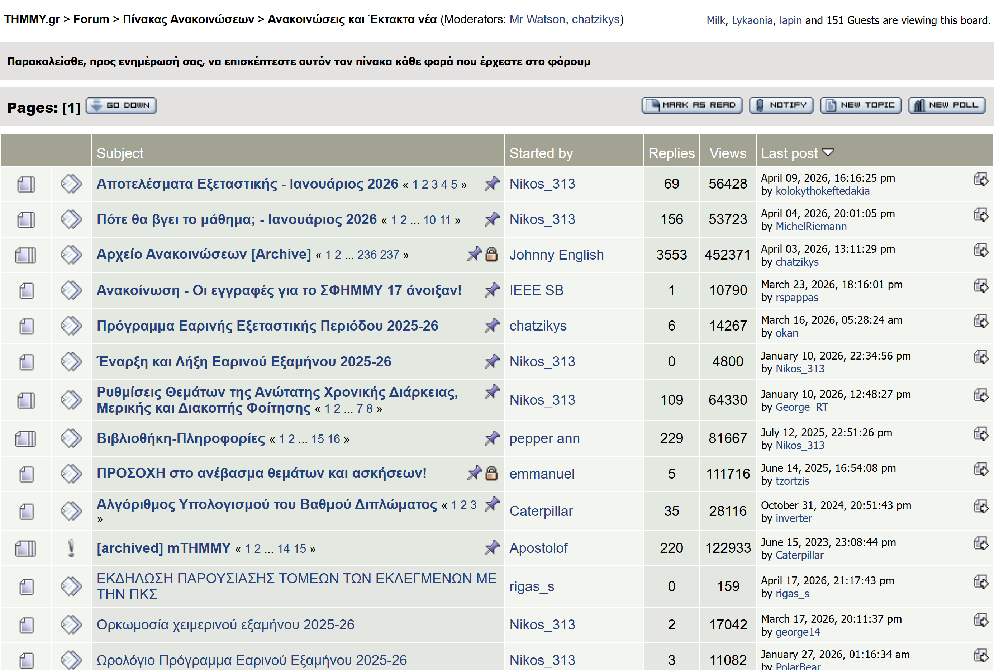 |  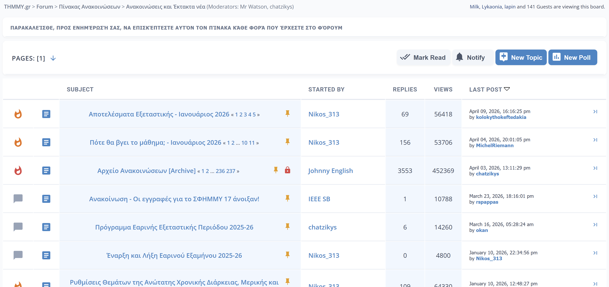 |  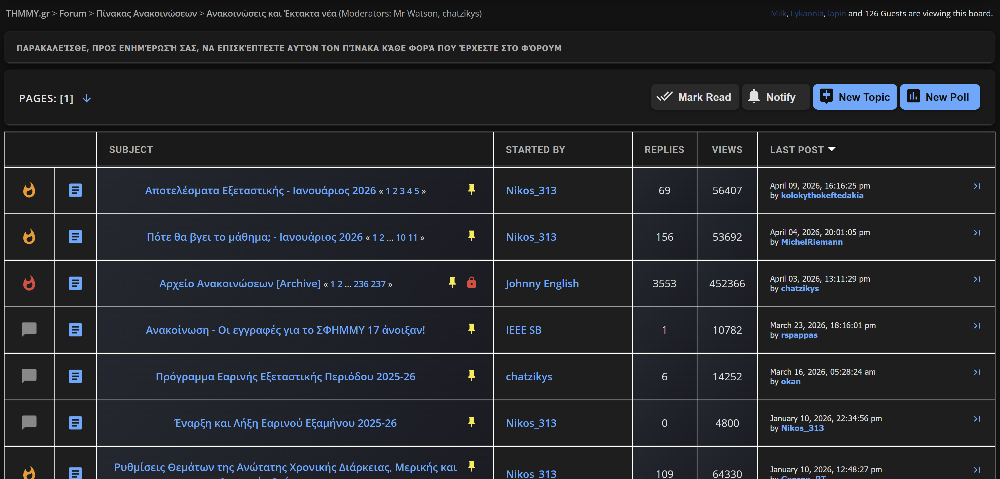 |
| **Downloads** 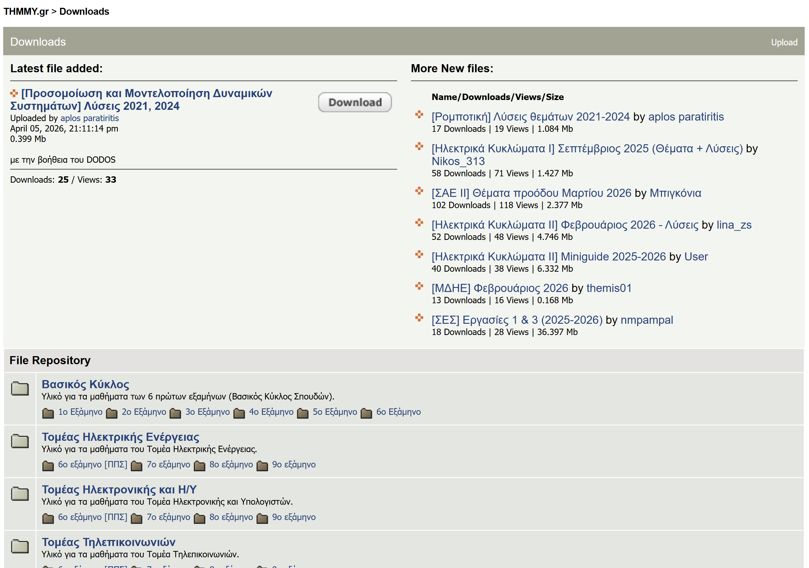 |  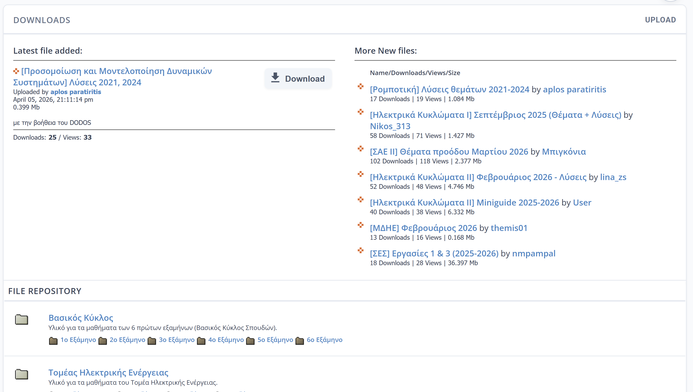 |  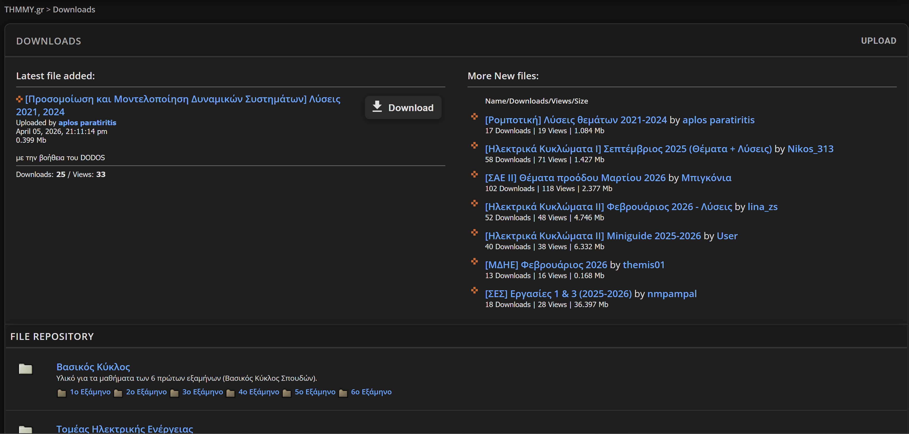 |

## How to use it

You can apply this right now using a CSS injector extension, like Stylus.

1. Install **Stylus** for [Chrome](https://chrome.google.com/webstore/detail/stylus/clngdbkpkpeebahjckkjfobafhncgmne) or [Firefox](https://addons.mozilla.org/en-US/firefox/addon/styl-us/).
2. Open thmmy.gr in your browser.
3. Click the Stylus extension icon and select **"Write style for: thmmy.gr"**.
4. Copy the CSS from either the dark or light file in this repository.
5. Paste it into the editor and hit Save. 

*The top header and left sidebar can be toggled via the new floating buttons in the top corners to free up screen space.*

## The Power of CSS Injection

CSS injection isn't just for making small changes to colors. By combining modern CSS layout tools with embedded custom images (like SVGs and base64) or even any other image from across the web, it's possible to completely rebuild the forum's UI without needing any modifications to the site's delicate backend. 

Here is a glimpse of what else is possible using this exact same method:

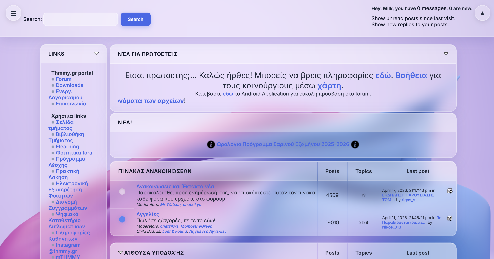
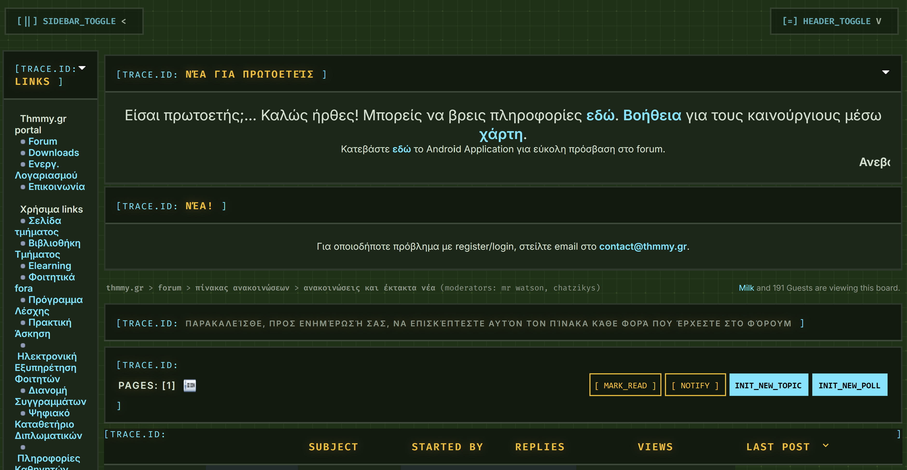
